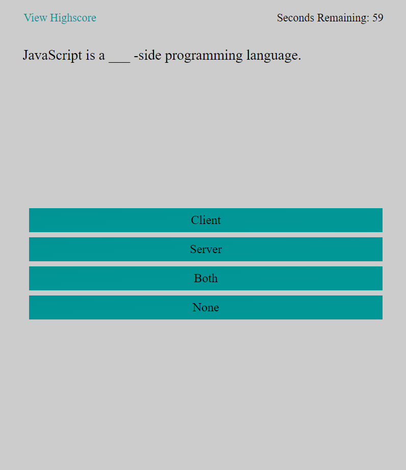

# Javascript Quiz

## Description
Create a website that that will quiz the user on Javascript. User will be able to save highscores, and will be timed for the quiz.

## Installation
N/A

## Usage

https://deweywatkins77.github.io/JavascriptQuiz/

will take you to the webpage shown below.

To use the page click the start button to start the quiz. You will have 60 seconds to complete the quiz. Selecting an incorrect answer will subtract 5 seconds from the time remaining. If all the questions are answered before time runs out you will be able to save your score. Only the top 10 scores are saved. Clicking on "View Highscore" will display a popup window with the top 10 scores. Winning or losing will prompt a play again button.

## License

Refer to Repository License.
